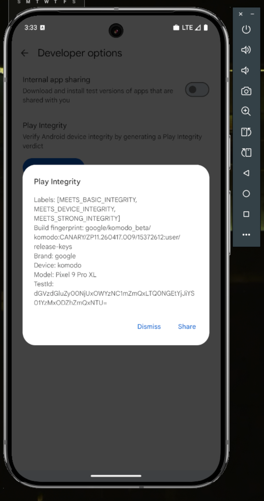

<div align="center">

# Rooted Pixel AVD · Play Integrity

**A reproducible recipe for a rooted Pixel-class Android emulator (AVD) that passes Google Play Integrity.**

[](docs/INTEGRITY_CHAIN.md)
[](docs/INTEGRITY_CHAIN.md)
[](device/pif/custom.pif.prop)
[](kernel-build/)
[](#scope)

🌐 **[Live site &amp; overview →](https://tanishmeh.github.io/AVD_Rooted_Integrity/)**



</div>

---

A reproducible recipe for a **rooted Pixel-class Android emulator (AVD) that
passes Google Play Integrity** (`MEETS_DEVICE_INTEGRITY`, Play Protect
certified) and presents as real Pixel hardware to apps.

It combines a custom kernel (KernelSU-Next + SUSFS + anti-emulator source
patches) with an on-device `/data/adb/` setup (prop spoofs, attestation-chain
forging via TEESimulator + a keybox, `/proc` bind mounts, and root-module
hiding).

> **This is a development/testing tool** for reproducing strong-integrity device
> behavior on an emulator. Bring your own keybox.

## What's here

| Path | What |
|---|---|
| [`kernel-build/`](kernel-build/) | Docker + scripts that build AOSP `common-android15-6.6` with KSU-Next, SUSFS, module-vermagic bypass, and `/proc/{modules,cpuinfo}` + banner spoofs. Output: `out/Image.gz`. |
| [`device/data_adb/`](device/) | The on-device setup pushed to `/data/adb`: `post-fs-data.d/` prop spoofs + bind mounts, `service.d/` watchdogs, SUSFS rules, `avd-fake/` fakes, and TrickyStore config. |
| [`device/pif/`](device/pif/) | PlayIntegrityFork profile (Pixel 9 / `tokay` / CANARY). |
| [`device/avd-config/`](device/avd-config/) | Host-side `config.ini` + `advancedFeatures.ini` templates (the critical Wi-Fi flags). |
| [`device/modules.md`](device/modules.md) | Prerequisite root modules + where to get them (not vendored). |
| [`scripts/`](scripts/) | `start_avd.sh` (cold-boot with the custom kernel), `install-device-setup.sh` (push the setup + keybox to a rooted AVD), and `verify-integrity.sh` (read-only health check, incl. the GENERATE-vs-PATCH mode check). |
| [`docs/`](docs/) | [`REPRODUCTION.md`](docs/REPRODUCTION.md) — step-by-step. [`INTEGRITY_CHAIN.md`](docs/INTEGRITY_CHAIN.md) — why each layer matters. |

## Quick start

```bash
# 1. Build the kernel (Docker; ~10 GB, 5-25 min)
#    The kbuild-sources named volume is required on macOS (case-insensitive FS) —
#    see kernel-build/README.md.
cd kernel-build && docker build -t kbuild . && \
  docker run --rm -v "$PWD":/work -v kbuild-sources:/work/sources \
    -w /work kbuild ./scripts/build-all.sh && cd ..

# 2. Provide your keybox (gitignored — never commit a real one)
cp /path/to/your/keybox.xml device/data_adb/tricky_store/keybox.xml

# 3. Boot the AVD with the custom kernel
./scripts/start_avd.sh

# 4. Install the root modules (see device/modules.md), then:
./scripts/install-device-setup.sh

# 5. Reboot clean and check Play Integrity.
```

Full walkthrough: [`docs/REPRODUCTION.md`](docs/REPRODUCTION.md).

## ⚠️ The two traps that waste days (read before debugging)

If integrity "randomly" stops working, it is almost always one of these:

1. **Never manually restart `keymint` / `keystore2` / `TEESimulator`.** It feels
   like the right move (and old guides say to), but it flips TEESimulator from
   **GENERATE** mode (valid keybox chain) into **PATCH** mode (a chain Google
   rejects) → empty verdict. **To apply any change, cold reboot. Recovery from a
   broken verdict is also just a cold reboot — never a service restart.**
2. **Never run `autopif`.** It overwrites the pinned Pixel 9 (`tokay`)
   `custom.pif.prop` with a drifting profile (e.g. `felix`/Pixel Fold) whose
   fingerprint doesn't match → verdict fails.

After a clean boot, confirm TEESimulator is in GENERATE mode:

```bash
./scripts/verify-integrity.sh    # read-only; checks GENERATE-vs-PATCH and more
```

The full story is in [`docs/REPRODUCTION.md` §7–§9](docs/REPRODUCTION.md) and
[`docs/INTEGRITY_CHAIN.md` "Layer 1b"](docs/INTEGRITY_CHAIN.md).

## The keybox (read this)

TrickyStore/TEESimulator forges the hardware attestation chain from
`device/data_adb/tricky_store/keybox.xml`. That file is **`.gitignored`** and is
**not** in this repo — a keybox committed to a public repo gets harvested and
revoked by Google within hours, after which integrity stops verifying. Use
[`keybox.xml.example`](device/data_adb/tricky_store/keybox.xml.example) as the
format reference and supply your own. A TEE-class keybox reaches
`MEETS_DEVICE_INTEGRITY`; `MEETS_STRONG_INTEGRITY` needs StrongBox and is
unreachable on an emulator.

## Scope

- ✅ Custom kernel, prop/`/proc` spoofing, attestation forging, root hiding,
  `virt_wifi` networking — everything needed for the PI device-integrity verdict.
- ❌ **No APKs / no sensor-name spoofing** — the Goldfish sensor vendor strings
  remain (a known gap; not required for the verdict).
- ❌ **No carrier/eSIM provisioning** — out of scope.
- ❌ **No prebuilt binaries / device images** — source + scripts only.

## Validated configuration

Pixel 9 (`tokay`) CANARY profile, android-36 `google_apis_playstore arm64-v8a`,
custom 6.6 kernel. Module versions this was validated against are in
[`device/modules.md`](device/modules.md).

## Credits

KernelSU-Next, SUSFS (simonpunk), Wild Kernels, TEESimulator (JingMatrix),
PlayIntegrityFork (osm0sis/chiteroman), ReZygisk (PerformanC), Vector
(JingMatrix). See `device/modules.md` for links.
